# UNIVERSIDAD TÉCNICA DE AMBATO
## FACULTAD DE INGENIERÍA EN SISTEMAS, ELECTRÓNICA E INDUSTRIAL
### CARRERA DE TECNOLOGÍAS DE LA INFORMACIÓN

---

* **ASIGNATURA:** GESTIÓN Y EVALUACIÓN DE PROYECTOS TI
* **NIVEL:** QUINTO SEMESTRE
* **CICLO ACADÉMICO:** JULIO 2026 – DICIEMBRE 2026
* **DOCENTE:** Ing. Mg. Kléver Renato Urvina Barrionuevo
* **PRÁCTICA:** GUÍA APE UNIDAD 2 — Planificación de un Proyecto TI
* **INTEGRANTES DEL GRUPO:**
  1. Alcócer Diego (Líder / Director de Proyecto)
  2. *[Apellido Nombre - Integrante 2]*
  3. *[Apellido Nombre - Integrante 3]*
* **FECHA DE ELABORACIÓN:** 1 de Octubre de 2026

---

# INFORME DE PLANIFICACIÓN DEL PROYECTO TI: HERRAMIENTA WEB "MINI-PROJECT"

---

## 1. ELABORACIÓN DEL ACTA DE CONSTITUCIÓN DEL PROYECTO (PROJECT CHARTER)

### 1.1 Información General del Proyecto
* **Nombre del Proyecto:** Desarrollo e Implementación de la Herramienta Web "Mini-Project" para la Gestión de Cronogramas TI mediante Metodologías PERT/CPM, EDT Dinámica y Diagramas de Gantt.
* **Sigla / Código del Proyecto:** MP-PERT-2026
* **Patrocinador (Sponsor):** Facultad de Ingeniería en Sistemas, Electrónica e Industrial (FISEI – UTA) / Cátedra de Gestión de Proyectos TI.
* **Director del Proyecto (Project Manager):** Diego Alcócer.
* **Fecha de Inicio:** Lunes, 12 de octubre de 2026.
* **Fecha Estimada de Finalización:** Viernes, 18 de diciembre de 2026.
* **Duración Prevista:** 10 semanas lectivas (50 días hábiles).

---

### 1.2 Propósito y Justificación del Proyecto
En la gestión moderna de proyectos de Tecnologías de la Información, la estimación del tiempo y la administración del camino crítico representan factores determinantes para el éxito. El software comercial dominante (como Microsoft Project, Primavera P6 o Jira) presenta curvas de aprendizaje empinadas, costos de licenciamiento inaccesibles para el entorno universitario y de pequeñas empresas, o una implementación superficial de la metodología probabilística PERT (*Program Evaluation and Review Technique*) basada en estimaciones de tres puntos ($t_o, t_m, t_p$).

El propósito del proyecto **Mini-Project** es diseñar, desarrollar e implementar una plataforma web ágil, reactiva y autónoma (*offline-first* con persistencia local en SQLite) que permita a directores de proyectos, ingenieros de software y estudiantes:
1. Estructurar jerárquicamente el alcance bajo la metodología **EDT (Estructura de Desglose del Trabajo)** en hasta 4 niveles según la regla del 100% del PMBOK.
2. Modelar la incertidumbre temporal mediante la distribución beta de **PERT** (duración esperada $t_e = \frac{t_o + 4t_m + t_p}{6}$ y varianza $\sigma^2 = (\frac{t_p - t_o}{6})^2$).
3. Computar en tiempo real el algoritmo **CPM (Critical Path Method)** mediante pasadas hacia adelante y hacia atrás (*Forward / Backward Pass*) determinando holgura total ($HT$), holgura libre ($HL$) y la ruta crítica del proyecto.
4. Visualizar simultáneamente la línea de tiempo en un **Diagrama de Gantt interactivo** y la topología de red en un **Diagrama PERT en nodos (AON - Activity on Node)** con tarjetas de 6 cuadrantes estandarizadas.

---

### 1.3 Objetivos del Proyecto (Criterios SMART)

#### 1.3.1 Objetivo General
Desarrollar una aplicación web para la gestión integral de cronogramas de proyectos TI, que integre módulos de desglose jerárquico EDT, estimación probabilística PERT, cálculo automatizado de la Ruta Crítica (CPM) y visualizaciones interactivas de Gantt y diagramas de red AON, en un plazo de 10 semanas lectivas y con un presupuesto inicial referencial de \$ 3,250.00 USD.

#### 1.3.2 Objetivos Específicos
1. **Analizar y modelar los requerimientos funcionales y matemáticos:** Formalizar las fórmulas de distribución Beta PERT, cálculo de holguras, matrices de adyacencia de grafos acíclicos dirigidos (DAG) y algoritmos de detección de ciclos en las primeras 2 semanas del proyecto.
2. **Diseñar la arquitectura técnica desacoplada:** Construir una arquitectura full-stack moderna basada en *React + TypeScript + Vite* en el cliente, y un backend liviano con *Node.js + Express + SQLite (sql.js)* para persistencia local portable sin requerir la instalación de motores de bases de datos pesados.
3. **Implementar el motor analítico CPM y la visualización de cronogramas:** Codificar el algoritmo topológico de ordenación de Kahn, cálculo de tiempos tempranos/tardíos, y renderizado SVG reactivo para el Diagrama de Gantt y el Diagrama PERT con nodos de 6 cuadrantes estándar.
4. **Validar la precisión y rendimiento de la plataforma:** Ejecutar pruebas de estrés y validación algorítmica sobre un proyecto modelo de al menos 50 actividades interconectadas (Sistema de Recaudo Electrónico), garantizando tiempos de renderizado y recálculo reactivo inferiores a 200 ms.

---

### 1.4 Interesados Principales (Stakeholders Iniciales)
* **Docente de la Asignatura:** Ing. Mg. Kléver Urvina (Revisa el cumplimiento metodológico según ISO 21500 / PMBOK).
* **Equipo de Desarrollo (Estudiantes FISEI-TI):** Responsables del análisis, diseño UI/UX, arquitectura full-stack, algoritmos y documentación.
* **Usuarios Finales (Estudiantes y Project Managers TI):** Quienes utilizarán la herramienta para planificar sus asignaciones y proyectos de software.

---

### 1.5 Criterios de Éxito del Proyecto
* **Criterio Funcional:** El sistema calcula con precisión matemática del 100% las holguras y rutas críticas en comparación con cálculos manuales y MS Project.
* **Criterio Técnico:** Despliegue funcional local de cero configuración (*zero-config*) mediante scripts automatizados de compilación (`npm run build`) y base de datos con *auto-seed*.
* **Criterio Temporal:** Entrega de la versión candidata a producción y defensa antes del cierre del ciclo académico (Diciembre 2026).
* **Criterio Académico:** Aprobación de la Guía APE Unidad 2 con una calificación de excelencia (≥ 9.0/10) según la rúbrica oficial.

---

### 1.6 Supuestos y Restricciones Iniciales
* **Supuestos:**
  - El entorno de ejecución del cliente cuenta con Node.js (v18 o superior) y un navegador web moderno (Chromium / Firefox).
  - Los integrantes del equipo poseen dominio de TypeScript, React, Tailwind CSS y algoritmos de grafos.
* **Restricciones:**
  - Plazo estricto e inamovible de 50 días hábiles según el calendario académico de la UTA.
  - El software debe funcionar en modalidad local monousuario (*offline-first*) sin depender de servicios en la nube de pago.

---

## 2. IDENTIFICACIÓN Y ANÁLISIS DE INTERESADOS (STAKEHOLDERS)

### 2.1 Registro de Interesados

| ID | Nombre / Grupo | Rol en el Proyecto | Tipo | Expectativas Principales | Nivel de Autoridad |
| :---: | :--- | :--- | :---: | :--- | :---: |
| **INT-01** | Ing. Mg. Kléver Urvina | Docente de la Cátedra / Patrocinador Académico | Interno | Rigor metodológico PMBOK/ISO 21500, exactitud matemática en CPM y entrega puntual. | **Alto** |
| **INT-02** | Diego Alcócer | Director de Proyecto / Desarrollador Líder | Interno | Coordinación integral, cumplimiento de hitos, arquitectura técnica y calidad del entregable. | **Alto** |
| **INT-03** | Integrante 2 | Arquitecto de Software / Desarrollador Frontend | Interno | Construcción de componentes UI (Gantt, PERT, TreeGrid), reactividad y rendimiento visual. | **Medio** |
| **INT-04** | Integrante 3 | Ingeniero de Datos / Algoritmos | Interno | Motor de cálculo CPM, persistencia SQLite, validaciones de grafos DAG y pruebas unitarias. | **Medio** |
| **INT-05** | Estudiantes de la FISEI | Usuarios Finales Primarios | Externo | Interfaz intuitiva, fácil ingreso de datos, visualizaciones claras y exportación de reportes. | **Bajo** |
| **INT-06** | Coordinación de Carrera TI | Entidad Reguladora Académica | Externo | Cumplimiento del plan de estudios y pertinencia formativa de la práctica de aplicación. | **Alto** |

---

### 2.2 Matriz de Influencia vs. Interés (Poder / Interés)

```
        ▲ PODER / INFLUENCIA
        │
   ALTO │  [Mantener Satisfecho]         │  [Gestionar de Cerca] (Claves)
        │  • Coordinación de Carrera TI  │  • Docente (Ing. Kléver Urvina)
        │                                │  • Director de Proyecto (Diego)
        ├────────────────────────────────┼─────────────────────────────────
   BAJO │  [Monitorear]                  │  [Mantener Informado]
        │                                │  • Estudiantes FISEI / Usuarios
        │                                │  • Desarrolladores del Equipo
        │                                │
        └────────────────────────────────┴────────────────────────────────►
          BAJO                             ALTO            INTERÉS
```

### 2.3 Estrategias de Gestión de Interesados
1. **Gestionar de Cerca (Docente Evaluador):** Revisiones periódicas en horas presenciales de clase (8 horas de acompañamiento según la guía), validación continua del avance en Git y retroalimentación directa sobre la metodología.
2. **Mantener Satisfecho (Coordinación de Carrera):** Asegurar que el informe académico y el código fuente cumplan con las políticas de licenciamiento abierto y los estándares de la UTA.
3. **Mantener Informado (Estudiantes / Usuarios de Prueba):** Sesiones de pruebas de usabilidad donde compañeros de nivel prueben ingresar sus propios proyectos para validar que la interfaz sea comprensible y libre de fallos (*flickers* o recargas molestas).

---

## 3. DEFINICIÓN DE ALCANCE Y DESGLOSE DEL TRABAJO (EDT / WBS)

### 3.1 Declaración del Alcance del Proyecto (Project Scope Statement)

#### 3.1.1 Alcance del Producto
La aplicación web **Mini-Project** proveerá un entorno de trabajo integral compuesto por cuatro módulos principales interactivos:
1. **Módulo EDT Jerárquico (TreeGrid):** Editor en tabla arborescente con indentación dinámica, numeración multinivel automática (1, 1.1, 1.1.1, 1.1.1.1), asignación de responsables y edición directa de duraciones optimista, probable y pesimista.
2. **Módulo de Cálculo CPM Reactivo:** Servicio de resolución topológica que computa $ES, EF, LS, LF, HT, HL$ y marca la ruta crítica en rojo automáticamente ante cualquier cambio de duración o dependencia.
3. **Módulo Diagrama de Gantt:** Cronograma gráfico interactivo con escala temporal de días naturales y hábiles, barras de tareas, barras de holgura, líneas de enlace de dependencias vectoriales y buscador de tareas en tiempo real.
4. **Módulo Diagrama de Red PERT (AON):** Grafo con tarjetas estándar de 6 cuadrantes que muestran tiempos tempranos, tardíos, duración y holgura, con curvaturas Bézier suaves, auto-organización en columnas topológicas y prevención de colisión de flechas.
5. **Módulo de Recursos y Semillero:** Gestión de miembros del equipo con roles y avatares, y mecanismo de *auto-seed* para inicializar proyectos de prueba con un solo clic.

#### 3.1.2 Entregables Principales del Proyecto
* **Entregable 1:** Repositorio en GitHub con código fuente documentado y versionado (*branches* limpias, commits semánticos).
* **Entregable 2:** Sistema web compilado y funcional en arquitectura cliente-servidor monorepo (`npm run dev`).
* **Entregable 3:** Base de datos portátil SQLite con semilla autoejecutable (`seed.sql` del Sistema de Recaudo).
* **Entregable 4:** Informe Académico Final en formato PDF (`Apellido_Grupo_GuiaAPE2.pdf`).

#### 3.1.3 Exclusiones Explícitas (Lo que NO incluye el proyecto)
* Conexión a servidores en la nube de pago (AWS, Azure o Firebase) en la primera versión.
* Autenticación multi-usuario con roles y contraseñas (el sistema opera en modalidad local de un solo usuario).
* Algoritmos de nivelación de recursos por encima de la capacidad de horas-hombre (*Resource Leveling* queda para la versión 2.0).

---

### 3.2 Diagrama Jerárquico de la EDT (WBS)

```mermaid
graph TD
  P["1. Herramienta Web Mini-Project"]
  
  P --> F1["1.1 Gestión del Proyecto"]
  P --> F2["1.2 Análisis y Especificación"]
  P --> F3["1.3 Diseño y Arquitectura"]
  P --> F4["1.4 Construcción y Desarrollo"]
  P --> F5["1.5 Pruebas y Validación"]
  P --> F6["1.6 Despliegue y Cierre"]

  F1 --> W11["1.1.1 Planificación Inicial"]
  F1 --> W12["1.1.2 Control y Seguimiento"]

  F2 --> W21["1.2.1 Requerimientos Funcionales"]
  F2 --> W22["1.2.2 Modelado Algorítmico"]

  F3 --> W31["1.3.1 Arquitectura del Sistema"]
  F3 --> W32["1.3.2 Diseño UI/UX"]

  F4 --> W41["1.4.1 Módulo EDT"]
  F4 --> W42["1.4.2 Motor CPM/PERT"]
  F4 --> W43["1.4.3 Módulo Gantt"]
  F4 --> W44["1.4.4 Módulo Diagrama PERT"]

  F5 --> W51["1.5.1 Pruebas de Software"]
  F5 --> W52["1.5.2 Validación Matemática"]

  F6 --> W61["1.6.1 Empaquetado y Entrega"]
  F6 --> W62["1.6.2 Documentación Final"]
```



---

### 3.3 Tabla Estructurada de la EDT (Descomposición Completa)

| Código EDT | Nivel | Elemento / Entregable | Tipo | Responsable |
| :--- | :---: | :--- | :---: | :--- |
| **1** | 0 | **Herramienta Web Mini-Project (PERT/CPM/EDT)** | Proyecto | Diego Alcócer |
| **1.1** | 1 | **Gestión del Proyecto** | Fase | Diego Alcócer |
| 1.1.1 | 2 | Planificación y Constitución | Paquete | Diego Alcócer |
| 1.1.1.1 | 3 | Elaboración del Acta de Constitución del Proyecto | Actividad | Diego Alcócer |
| 1.1.1.2 | 3 | Elaboración del Registro y Análisis de Interesados | Actividad | Diego Alcócer |
| 1.1.2 | 2 | Monitoreo y Control del Proyecto | Paquete | Integrante 2 |
| 1.1.2.1 | 3 | Gestión del cronograma y reuniones de seguimiento semanal | Actividad | Integrante 2 |
| 1.1.2.2 | 3 | Control de versiones y repositorio en Git/GitHub | Actividad | Integrante 3 |
| **1.2** | 1 | **Análisis y Especificación de Requerimientos** | Fase | Integrante 2 |
| 1.2.1 | 2 | Especificación de Requerimientos | Paquete | Integrante 2 |
| 1.2.1.1 | 3 | Levantamiento de historias de usuario y casos de uso | Actividad | Integrante 2 |
| 1.2.1.2 | 3 | Especificación de requerimientos no funcionales (rendimiento) | Actividad | Integrante 2 |
| 1.2.2 | 2 | Modelado Algorítmico y Matemático | Paquete | Integrante 3 |
| 1.2.2.1 | 3 | Formalización de ecuaciones PERT (Beta) y holguras CPM | Actividad | Integrante 3 |
| 1.2.2.2 | 3 | Modelado del grafo de dependencias y detección de ciclos (DAG) | Actividad | Integrante 3 |
| **1.3** | 1 | **Diseño y Arquitectura del Sistema** | Fase | Integrante 2 |
| 1.3.1 | 2 | Arquitectura de Software y Datos | Paquete | Integrante 3 |
| 1.3.1.1 | 3 | Diseño de la arquitectura full-stack React + Node.js + Express | Actividad | Integrante 3 |
| 1.3.1.2 | 3 | Diseño del esquema relacional SQLite (`schema.sql`) | Actividad | Integrante 3 |
| 1.3.2 | 2 | Diseño de Interfaz de Usuario (UI/UX) | Paquete | Integrante 2 |
| 1.3.2.1 | 3 | Diseño de componentes visuales en Tailwind CSS (Paleta Slate) | Actividad | Integrante 2 |
| 1.3.2.2 | 3 | Diseño de tarjetas nodales AON de 6 campos para el PERT | Actividad | Integrante 2 |
| **1.4** | 1 | **Construcción y Desarrollo de Módulos** | Fase | Todo el Equipo |
| 1.4.1 | 2 | Desarrollo del Módulo EDT Jerárquico | Paquete | Diego Alcócer |
| 1.4.1.1 | 3 | Implementación de TreeGrid con indentación y códigos automáticos | Actividad | Diego Alcócer |
| 1.4.1.2 | 3 | Modal de estimación PERT probabilística de 3 puntos | Actividad | Diego Alcócer |
| 1.4.2 | 2 | Motor de Cálculo CPM y Servicios de API | Paquete | Integrante 3 |
| 1.4.2.1 | 3 | Algoritmo topológico Kahn y cálculo de pasadas Forward/Backward | Actividad | Integrante 3 |
| 1.4.2.2 | 3 | Endpoints REST de proyectos, nodos EDT y dependencias | Actividad | Integrante 3 |
| 1.4.3 | 2 | Desarrollo del Diagrama de Gantt Interactivo | Paquete | Integrante 2 |
| 1.4.3.1 | 3 | Motor de renderizado de cuadrícula temporal (Días hábiles y naturales) | Actividad | Integrante 2 |
| 1.4.3.2 | 3 | Renderizado de barras críticas, no críticas y holguras totales | Actividad | Integrante 2 |
| 1.4.4 | 2 | Desarrollo del Diagrama de Red PERT | Paquete | Diego Alcócer |
| 1.4.4.1 | 3 | Algoritmo de posicionamiento por columnas de rangos topológicos | Actividad | Diego Alcócer |
| 1.4.4.2 | 3 | Conectores Bézier dinámicos con prevención de colisiones | Actividad | Diego Alcócer |
| **1.5** | 1 | **Pruebas, Optimización y Validación** | Fase | Integrante 3 |
| 1.5.1 | 2 | Pruebas de Software e Integración | Paquete | Integrante 3 |
| 1.5.1.1 | 3 | Pruebas de sincronización entre pestañas y eliminación de flickers | Actividad | Integrante 3 |
| 1.5.1.2 | 3 | Verificación de compilación limpia de Vite y TypeScript (`tsc -b`) | Actividad | Integrante 3 |
| 1.5.2 | 2 | Validación Metodológica y Datos de Prueba | Paquete | Diego Alcócer |
| 1.5.2.1 | 3 | Generación del dataset y script de seed (Proyecto Recaudo 50 tareas) | Actividad | Diego Alcócer |
| 1.5.2.2 | 3 | Validación cruzada de la ruta crítica contra MS Project | Actividad | Diego Alcócer |
| **1.6** | 1 | **Despliegue, Documentación y Cierre** | Fase | Diego Alcócer |
| 1.6.1 | 2 | Empaquetado y Configuración de Arranque | Paquete | Integrante 3 |
| 1.6.1.1 | 3 | Configuración de scripts unificados de ejecución (`npm run dev`) | Actividad | Integrante 3 |
| 1.6.1.2 | 3 | Automatización de auto-seed en SQLite al clonar el repositorio | Actividad | Integrante 3 |
| 1.6.2 | 2 | Documentación Académica Final | Paquete | Diego Alcócer |
| 1.6.2.1 | 3 | Redacción del informe técnico final Guía APE Unidad 2 | Actividad | Diego Alcócer |
| 1.6.2.2 | 3 | Generación del entregable PDF (`Apellido_Grupo_GuiaAPE2.pdf`) | Actividad | Diego Alcócer |

---

### 3.4 Diccionario de la EDT (Muestra de Paquetes Clave)

#### Diccionario: 1.4.2 Motor de Cálculo CPM y Servicios de API
* **Descripción del Trabajo:** Desarrollo del servicio algorítmico en Node.js que toma el grafo de actividades y dependencias de un proyecto, valida la ausencia de dependencias circulares y calcula los 6 valores fundamentales del CPM: Inicio Temprano ($ES$), Fin Temprano ($EF$), Inicio Tardío ($LS$), Fin Tardío ($LF$), Holgura Total ($HT$) y Holgura Libre ($HL$).
* **Criterio de Aceptación:** Cálculo exacto verificado contra ejercicios resueltos en clase de la asignatura; tiempo de procesamiento menor a 50 milisegundos para 100 actividades; marcado estricto de actividades críticas cuando $HT = 0$.
* **Entregable:** Archivo de servicio `server/src/services/cpm.ts` y controladores de rutas en Express.

#### Diccionario: 1.4.4 Desarrollo del Diagrama de Red PERT
* **Descripción del Trabajo:** Construcción del lienzo visual interactivo en React que renderiza las actividades en forma de cajas de 6 cuadrantes (AON). Organiza los nodos en columnas según su nivel topológico, traza aristas con curvas cúbicas Bézier y detiene las flechas 5px antes del borde de la tarjeta para evitar solapamientos con los números.
* **Criterio de Aceptación:** Soporte fluido para zoom y paneo manual; separación automática de flechas entrantes cuando un nodo tiene múltiples predecesoras; ausencia de parpadeos al alternar vistas.
* **Entregable:** Componente `PertDiagram.tsx` funcional y responsive.

---

## 4. FORMULACIÓN DEL CRONOGRAMA Y PRESUPUESTO INICIAL

### 4.1 Cronograma del Proyecto y Diagrama de Gantt

#### 4.1.1 Parámetros de Planificación
* **Fecha de Inicio del Proyecto:** Lunes, 12 de octubre de 2026.
* **Jornada Laboral:** Días hábiles de lunes a viernes (excluyendo fines de semana).
* **Duración Total:** 50 días hábiles (10 semanas lectivas).
* **Fecha de Término:** Viernes, 18 de diciembre de 2026.

#### 4.1.2 Tabla de Cronograma (Hitos y Duraciones)

| Fase / Hito Principal | Duración (Días Hábiles) | Fecha Inicio | Fecha Fin | Predecesora |
| :--- | :---: | :---: | :---: | :---: |
| **1.1 Gestión del Proyecto (Acta e Interesados)** | 6 días | 12/10/2026 | 19/10/2026 | — |
| **1.2 Análisis y Especificación Matemática** | 8 días | 20/10/2026 | 29/10/2026 | 1.1 |
| **1.3 Diseño Arquitectónico y UI/UX** | 8 días | 30/10/2026 | 10/11/2026 | 1.2 |
| **1.4 Construcción del Software (Sprint 1: EDT & CPM)** | 10 días | 11/11/2026 | 24/11/2026 | 1.3 |
| **1.4 Construcción del Software (Sprint 2: Gantt & PERT)** | 10 días | 25/11/2026 | 08/12/2026 | Sprint 1 |
| **1.5 Pruebas, Validación y Optimización** | 5 días | 09/12/2026 | 15/12/2026 | 1.4 |
| **1.6 Documentación Final y Cierre (Guía APE 2)** | 3 días | 16/12/2026 | 18/12/2026 | 1.5 |
| **HITO FINAL: Entrega en Aula Virtual Moodle** | 0 días | 18/12/2026 | 18/12/2026 | 1.6 |

#### 4.1.3 Representación en Diagrama de Gantt Semanal

```
Actividad / Fase          Sem 1  Sem 2  Sem 3  Sem 4  Sem 5  Sem 6  Sem 7  Sem 8  Sem 9  Sem 10
─────────────────────────────────────────────────────────────────────────────────────────────
1.1 Gestión del Proyecto  ████                                                         
1.2 Análisis y Requisitos        █████                                                
1.3 Diseño y Arquitectura              █████                                          
1.4 Módulo EDT & CPM                         ██████                                   
1.4 Módulo Gantt & PERT                             ██████                            
1.5 Pruebas e Integración                                  ███                        
1.6 Documentación y PDF                                       ██                      
HITO DE ENTREGA (Moodle)                                         ◆ (18 Dic 2026)
```

---

### 4.2 Estimación de Recursos y Presupuesto Inicial

Para la estimación financiera se utilizó el método de **Estimación Ascendente (Bottom-Up)**, calculando costos directos de mano de obra (equipo de desarrollo), costos directos de equipamiento y suministros, costos indirectos y una reserva de contingencia.

#### 4.2.1 Costos de Recursos Humanos (Mano de Obra Directa)
*Tarifa académica referencial para proyectos de desarrollo TI en Quinto Semestre: \$ 5.00 USD / hora.*

| Rol en el Proyecto | Integrante | Horas Estimadas | Tarifa / Hora | Costo Total |
| :--- | :--- | :---: | :---: | :---: |
| **Director de Proyecto & Dev Lead** | Diego Alcócer | 160 hrs | \$ 6.00 | \$ 960.00 |
| **Arquitecto Frontend (React/UI)** | Integrante 2 | 150 hrs | \$ 5.00 | \$ 750.00 |
| **Desarrollador Backend & Algoritmos** | Integrante 3 | 150 hrs | \$ 5.00 | \$ 750.00 |
| **SUBTOTAL RECURSOS HUMANOS:** | | **460 hrs** | | **\$ 2,460.00** |

#### 4.2.2 Costos de Equipamiento, Software y Servicios
| Concepto / Rubro | Descripción | Tipo | Costo Total |
| :--- | :--- | :---: | :---: |
| **Equipos de Cómputo** | Desgaste y amortización de 3 laptops de desarrollo | Directo | \$ 240.00 |
| **Conectividad a Internet** | Servicio de banda ancha durante las 10 semanas | Directo | \$ 90.00 |
| **Licencias y Servicios Cloud** | Software de soporte (GitHub, Figma, Vite, Node) Open Source | — | \$ 0.00 |
| **Suministros y Material de Estudio** | Bibliografía (PMBOK 6ta/7ma ed., libros de proyectos) | Indirecto | \$ 60.00 |
| **SUBTOTAL EQUIPOS Y SERVICIOS:** | | | **\$ 390.00** |

#### 4.2.3 Consolidación del Presupuesto y Reservas

| Componente del Presupuesto | Importe (USD) | % del Total |
| :--- | :---: | :---: |
| **Costo Directo (Personal + Equipamiento)** | \$ 2,850.00 | 87.7 % |
| **Costos Indirectos (Servicios administrativos, energía)** | \$ 100.00 | 3.1 % |
| **Línea Base de Costos (Cost Baseline):** | **\$ 2,950.00** | **90.8 %** |
| **Reserva de Contingencia (10% sobre la línea base por riesgos de cronograma)** | \$ 300.00 | 9.2 % |
| **PRESUPUESTO TOTAL DEL PROYECTO:** | **\$ 3,250.00 USD** | **100.0 %** |

---

## 5. CONCLUSIONES Y RECOMENDACIONES (SEGÚN LA GUÍA APE)

### 5.1 Conclusiones
1. La formulación formal del **Acta de Constitución** y la **identificación de interesados** delimitó con exactitud las expectativas docentes y técnicas de la cátedra de Gestión de Proyectos TI de la UTA, reduciendo la incertidumbre y previniendo la corrupción del alcance (*scope creep*).
2. La **Estructura de Desglose del Trabajo (EDT)** a 4 niveles jerárquicos demostró ser el artefacto vertebral para relacionar el producto de software con las unidades de trabajo medibles, permitiendo que la estimación probabilística PERT se ejecute exclusivamente sobre las actividades hoja, garantizando la consistencia matemática del cronograma.
3. El cálculo automatizado del **Método de la Ruta Crítica (CPM)** implementado en la aplicación reduce drásticamente el tiempo requerido para el control del cronograma en comparación con los métodos manuales, permitiendo identificar de forma instantánea qué actividades no admiten demora sin comprometer la fecha final del proyecto.

### 5.2 Recomendaciones
1. Se recomienda mantener una actualización periódica del registro de interesados en cada iteración o ciclo de entrega, asegurando que los requerimientos formativos del docente se vean reflejados en el producto.
2. Utilizar el mecanismo de respaldo en scripts de semilla (*seed.sql*) versionados en Git para garantizar que cualquier evaluador pueda reproducir los datos del cronograma y comprobar las holguras sin dificultades de configuración.

---

## 6. BIBLIOGRAFÍA (SEGÚN LA GUÍA DOCENTE)
1. **Angulo Aguirre, Luis.** (2015). *Preparación para la certificación PMP basado en la guía del PMBOK* (5a ed.). Macro.
2. **Baca Urbina, Gabriel.** (2017). *Evaluación de proyectos* (8a ed.). McGraw-Hill.
3. **Bataller, Alfonse.** (2016). *La gestión de proyectos* (1a ed.). Editorial UOC.
4. **Correa Candamil, C. H., Jiménez Roa, D. E., & Sarmiento Rojas, J. A.** (2020). *Gestión de proyectos aplicada al PMBOK 6ED* (1a ed.). Editorial UPTC.
5. **Project Management Institute (PMI).** (2021). *Guía de los Fundamentos para la Dirección de Proyectos (Guía del PMBOK)* (7ma ed.). PMI Standards.
